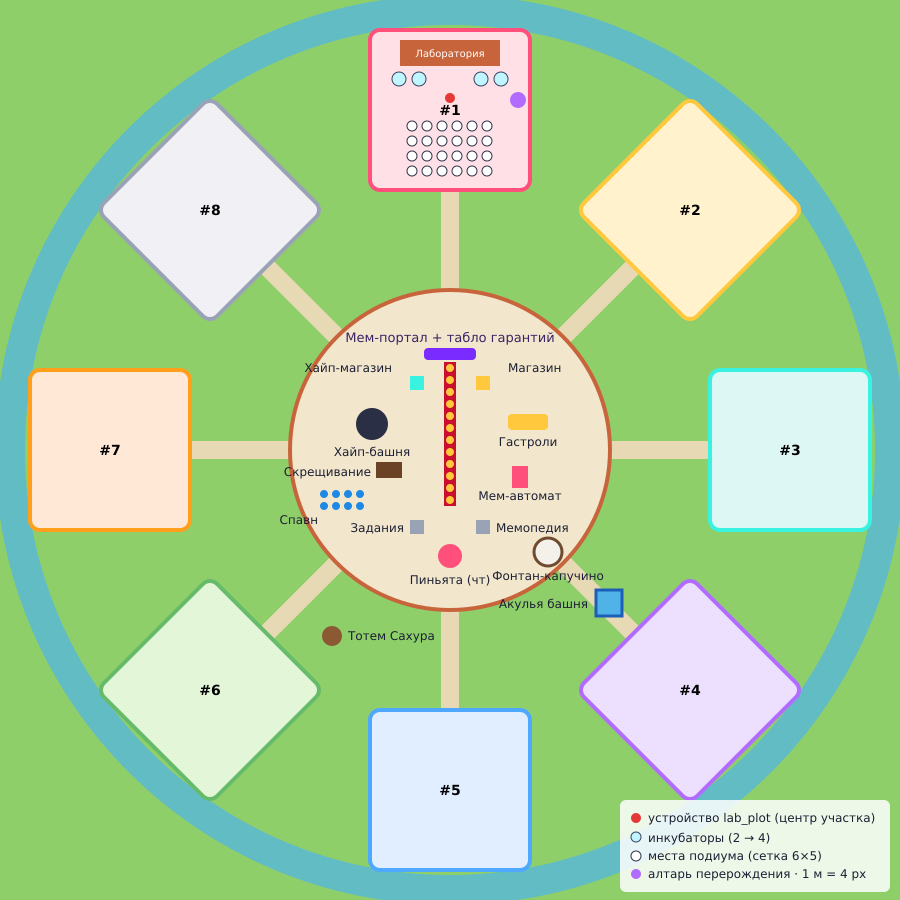

# 2. Карта и украшение



## 2.1 Общая идея

**Итальянская мем-набережная**: солнечный городок с терракотовыми крышами, лимонными деревьями,
кафе-зонтиками и мостовой, а в центре — сумасшедшая лаборатория с порталом, из которого
выкатываются мем-капсулы.

Правила:
- Хаб — место встречи. Всё интересное (конвейер, шторм, станции, пиньята) в центре, чтобы игроки
  видели друг друга и чужие редкие дропы.
- Участки — витрины. Подиум стоит между лабораторией и дорогой к хабу: кто идёт мимо, видит твою
  коллекцию.
- От любой точки до хаба не больше 15 секунд бега. Длинные пробежки убивают тайкун.
- Яркие ориентиры видны отовсюду: Хайп-башня (9 м), портал (6 м), фонтан-капучино.

## 2.2 Разметка (метры, центр острова = 0,0, север = +Y)

| Объект | Координаты | Размер | Проп |
|---|---|---|---|
| Хаб (площадь-брусчатка) | круг R = 40 | Ø 80 м | пол из галерей мостовой |
| Мем-портал | (0, +24), смотрит на юг | 5,4 × 1,4 × 6 м | `SM_MemePortal` |
| Конвейер | от (0, +22) до (0, −14), 12 сегментов по 3 м | 36 × 1,4 м | `SM_ConveyorSegment` × 12 |
| Окна покупки | центры сегментов, по одной кнопке | — | `button_device` × 12 |
| Табло гарантий | над порталом, 7 м | — | `billboard_device` |
| Хайп-башня | (−20, +7) | Ø 2,4, высота 9 м | `SM_HypeTower` + табло + VFX |
| Скрещивание | (−15, −4) | 3,2 × 1,4 м | `SM_FusionTable` + кнопка |
| Мем-автомат | (+18, −4) | 1,4 × 1 × 2,6 м | `SM_MemeMachine` + кнопка |
| Гастроли | (+20, +8), остановка | 5,6 × 2,3 × 3 м | `SM_TourBus` + кнопка |
| Хайп-магазин / Магазин | (−9, +17) / (+9, +17) | киоски | кнопки + `SM_SignBoard` |
| Задания / Мемопедия | (−9, −18) / (+9, −18) | стойки | кнопки + `SM_SignBoard` |
| Пиньята | (0, −26) | висит на 3 м | `SM_Pinata` (подвешенный) |
| Фонтан-капучино | (+25, −25) | Ø 5,2 м | `SM_CappuccinoFountain` |
| Спавн | (−28, −12), 8 точек | — | `player_spawner_device` × 8 |
| Кнопка «Домой» | у портала | — | `button_device` (поле `HomeButton`) |
| Участки #1–#8 | кольцо R = 85, через 45°, лицом к центру | 40 × 40 м | см. 2.3 |
| Тотем Сахура | (−30, −47) | высота 3,6 м | `SM_SahurTotem` |
| Акулья башня (паркур) | (+37, −37) | высота 25–30 м | галереи + `button_device` наверху |
| Поленья (ивент нед. 1) | 10–15 точек по карте | — | бревно из галереи + `button_device` |

## 2.3 Участок игрока (40 × 40 м)

```
             (к краю острова)
   ┌──────────────────────────────────────┐
   │   [ Здание лаборатории 12 × 6 м ]    │  ← дом из галерей: стены-штукатурка, терракота
   │  (И1) (И2)   [Лаборатория]  (И3) (И4) │  ← инкубаторы SM_Incubator, кнопка меню у двери
   │          ● lab_plot_device  (Алтарь)  │  ← алтарь перерождения SM_RebirthAltar + кнопка
   │  ○ ○ ○ ○ ○ ○                          │
   │  ○ ○ ○ ○ ○ ○    подиум: 6 × 5 мест,  │  ← места считает Verse: вперёд 5 м,
   │  ○ ○ ○ ○ ○ ○    шаг 2,6 м             │    влево 6,5 м от устройства
   │  ○ ○ ○ ○ ○ ○                          │
   │  ○ ○ ○ ○ ○ ○   [Табличка участка]     │  ← billboard: «Лаборатория #3 · 12.3K/с …»
   └───────────── вход с дороги ──────────┘
             (к хабу)
```

- `lab_plot_device` ставится в центр, **стрелкой к хабу**. Подиум появится перед ним.
- `PodiumOffset` = (500, −650, 0) см. Если подиум уходит в стену, двигай устройство, а не
  смещение.
- Пол подиума: плитка светлее травы, чтобы постаменты читались. Постаменты ставит Verse, руками
  ничего не нужно.
- Каждому участку — свой цвет: флажки, забор, табличка. #1 розовый, #2 жёлтый, #3 бирюзовый,
  #4 фиолетовый, #5 синий, #6 зелёный, #7 оранжевый, #8 серебряный. По цвету игрок узнаёт свою
  лабораторию издалека.
- `teleporter_device` «Дом» — у входа, лицом к подиуму.
- Инкубаторы стоят в ряд у фасада, между ними 3 м. Кнопка каждого — перед «дверцей» инкубатора,
  `prop_manipulator_device` — на самом пропе инкубатора. Табло — над ним на высоте 2,6 м.
- Барьер участка (по желанию, для PvP): невидимая стена по периметру, пропускает игроков и
  блокирует снаряды.

## 2.4 Украшение по зонам

**Хаб — «Пьяцца»:**
- Брусчатка кругами, по краю — низкий бордюр и 8 арок-выходов к дорогам (у каждой флажок цвета
  участка).
- **Красная дорожка**: конвейер с золотыми бортиками, вдоль него бархатные столбики с канатами (по
  2 м) — как вход в кино.
- Портал: вокруг — 4 уличных фонаря `SM_StreetLamp`, за порталом — неоновая вывеска «MEMI»
  (текстовые пропы Fortnite).
- 6 кафе-зонтиков `SM_CafeUmbrella` у магазина и заданий — место, где стоят и болтают.
- 8 лимонных деревьев `SM_LemonTree` по кругу площади.
- Хайп-башня: кольца светятся бирюзовым, VFX-молнии включает только шторм. Вокруг — табличка
  «Хайп-метр лобби».
- Станции подписаны вывесками `SM_SignBoard` + billboard с названием.

**Дороги к участкам:**
- Мощёные «виа» шириной 5 м, по бокам кипарисы и фонари через 10 м.
- Указатели на развилках: «Лаборатория #1 →».

**Участки:**
- Здание лаборатории: 2 этажа, штукатурка пастельного цвета участка, терракотовая крыша,
  балкон с цветами, вывеска «Laboratorio».
- Вокруг подиума — клумбы и низкий забор, на углах — лимонные деревья.
- Место под будущие «покраски участка» (косметика за V-Bucks): заборы и флажки держи отдельными
  пропами, чтобы их можно было менять.

**Край острова:**
- Вода вокруг, пирсы с лодками, на горизонте — силуэт вулкана (к ивенту «Извержение» на 5-й
  неделе) и космический купол (к 8-й неделе).

**Ивентовые зоны** (строятся заранее, включаются неделей контента):
- **Тотем Сахура**: полянка с бревенчатыми столбами, `SM_SahurTotem` в центре, кнопка «Сдать
  находки». Поленья разложены по всей карте, в том числе на крышах и у воды — чтобы игроки
  побегали.
- **Акулья башня**: паркур из платформ-волн вверх (25–30 м), на вершине кнопка «Забрать награду»
  и табло. Внизу — батут-подсказка.
- **Пиньята**: верёвка между двумя фонарями над южной частью пьяццы.

## 2.5 Свет, звук, эффекты

| Что | Как | Когда |
|---|---|---|
| Солнечный день | Day Sequence / настройки освещения острова: тёплое солнце, лёгкая дымка | всегда |
| Шторм | VFX Spawner (молнии, конфетти) над хабом и у башни + Audio Player (барабаны) | включает `lab_storm_device` |
| Пиньята | VFX конфетти | когда пиньята разбита |
| Фоновая музыка | Radio / Audio Player в хабе, тихая итальянская мелодия | всегда |
| Вылупление | звук «поп» и искры у инкубатора (VFX Spawner + Audio Player на участке) | по желанию, подключается в Verse рядом с `Hatch` |
| Портал | постоянный VFX-вихрь, мягкий гул | всегда |

Табло (billboard) везде одного стиля: крупный белый текст с тенью, фон по умолчанию.

## 2.6 Производительность

- Следи за шкалой памяти острова в UEFN, она не должна уходить в красное.
- Брейнроты — по 15 000 треугольников, на 8 участках до 240 штук. Включи **Nanite** у мешей
  брейнротов или сгенерируй LOD (см. 03-assets.md).
- Капсулы и постаменты — лёгкие (1,7–4 тыс.). Декор собирай из галерей Fortnite: они
  оптимизированы.
- Не ставь по VFX на каждый постамент: аура «Идеального» — это проп, а не эффект.

## 2.7 Маршрут новичка (проверяй на тесте)

1. Спавн на пьяцце → телепорт на свой участок (так делает Verse).
2. Табличка у входа «Твоя лаборатория #N» → дорога ведёт к хабу. Портал виден сразу.
3. Конвейер → покупка → назад к инкубатору: до 15 секунд бега.
4. Первый шторм лобби застаёт новичка в хабе. Станции в хабе он видит, пока бегает за капсулами.
